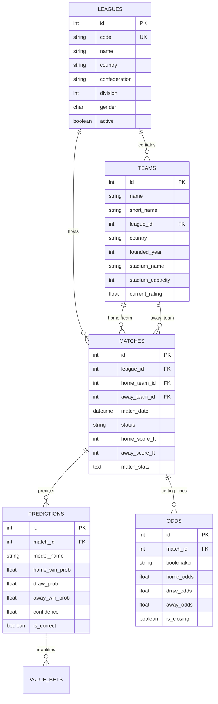

# 🗄️ Football Analytics Database Documentation

> **Sistema de Base de Datos para Análisis y Predicción Deportiva**  
> Versión: 2.1.0 | Última actualización: Junio 2025

## 📋 Tabla de Contenido

- [Visión General](#visión-general)
- [Arquitectura](#arquitectura)
- [Esquema de Base de Datos](#esquema-de-base-de-datos)
- [Tablas Principales](#tablas-principales)
- [Relaciones](#relaciones)
- [Índices y Optimización](#índices-y-optimización)
- [Triggers y Procedimientos](#triggers-y-procedimientos)
- [Vistas](#vistas)
- [Datos Iniciales](#datos-iniciales)
- [Migraciones](#migraciones)
- [Queries Comunes](#queries-comunes)
- [Performance](#performance)
- [Backup y Recuperación](#backup-y-recuperación)
- [Seguridad](#seguridad)

## 🎯 Visión General

### Propósito

La base de datos Football Analytics está diseñada para almacenar, gestionar y analizar datos relacionados con:

- **Ligas y competiciones** de fútbol a nivel mundial
- **Equipos y jugadores** con estadísticas detalladas
- **Partidos** con resultados y métricas de rendimiento
- **Predicciones ML** con evaluación de precisión
- **Cuotas de apuestas** y análisis de value betting
- **Configuración del sistema** y auditoría

### Tecnologías Soportadas

- **SQLite**: Desarrollo y testing local
- **PostgreSQL**: Producción y entornos distribuidos
- **Compatibilidad**: SQL estándar para portabilidad

### Características Principales

✅ **Escalabilidad**: Diseño para millones de partidos y predicciones  
✅ **Performance**: Índices optimizados para consultas analíticas  
✅ **Integridad**: Constraints y validaciones automáticas  
✅ **Auditabilidad**: Timestamps y logs de cambios  
✅ **Flexibilidad**: Soporte para múltiples confederaciones y formatos  

## 🏗️ Arquitectura

### Diagrama de Alto Nivel

```
┌─────────────────┐    ┌─────────────────┐    ┌─────────────────┐
│   REFERENCIAS   │    │     CORE        │    │   ANALYTICS     │
│                 │    │                 │    │                 │
│ • leagues       │    │ • teams         │    │ • predictions   │
│ • seasons       │    │ • matches       │    │ • odds          │
│ • system_config │    │ • players       │    │ • value_bets    │
│                 │    │                 │    │ • team_stats    │
└─────────────────┘    └─────────────────┘    └─────────────────┘
         │                       │                       │
         └───────────────────────┼───────────────────────┘
                                 │
                    ┌─────────────────┐
                    │   AUDITORIA     │
                    │                 │
                    │ • system_logs   │
                    │ • api_calls     │
                    │ • user_actions  │
                    └─────────────────┘
```

### Capas de Datos

#### 1. **Capa de Referencias** (Master Data)

- Datos estáticos y de configuración
- Ligas, temporadas, configuración del sistema
- Información que raramente cambia

#### 2. **Capa Core** (Datos Principales)

- Equipos, jugadores, partidos
- Datos operacionales del negocio
- Información que se actualiza regularmente

#### 3. **Capa Analytics** (Análisis y ML)

- Predicciones, cuotas, estadísticas
- Datos generados por algoritmos
- Métricas de rendimiento y evaluación

#### 4. **Capa de Auditoría** (Logs y Monitoreo)

- Logs del sistema, llamadas API
- Información para debugging y análisis
- Datos para compliance y seguridad

## 📊 Esquema de Base de Datos

### Diagrama ERD Simplificado



## 📋 Tablas Principales

### 🏆 leagues

**Propósito**: Almacena todas las ligas y competiciones de fútbol mundial.

```sql
CREATE TABLE leagues (
    id INTEGER PRIMARY KEY AUTOINCREMENT,
    code VARCHAR(10) UNIQUE NOT NULL,           -- 'PL', 'PD', 'SA', etc.
    name VARCHAR(100) NOT NULL,                 -- 'Premier League'
    country VARCHAR(50) NOT NULL,               -- 'England'
    confederation VARCHAR(20) NOT NULL,         -- 'UEFA', 'CONMEBOL'
    division INTEGER NOT NULL DEFAULT 1,       -- 1=Primera, 2=Segunda
    gender CHAR(1) NOT NULL DEFAULT 'M',       -- 'M'=Masculino, 'F'=Femenino
    active BOOLEAN NOT NULL DEFAULT true,      -- Liga activa/inactiva
    created_at TIMESTAMP DEFAULT CURRENT_TIMESTAMP,
    updated_at TIMESTAMP DEFAULT CURRENT_TIMESTAMP
);
```

**Datos de Ejemplo:**

| id | code | name | country | confederation | division | gender |
|----|------|------|---------|---------------|----------|--------|
| 1 | PL | Premier League | England | UEFA | 1 | M |
| 2 | PD | La Liga | Spain | UEFA | 1 | M |
| 3 | CL | Champions League | Europe | UEFA | 0 | M |

### ⚽ teams

**Propósito**: Información detallada de equipos de fútbol.

```sql
CREATE TABLE teams (
    id INTEGER PRIMARY KEY AUTOINCREMENT,
    name VARCHAR(100) NOT NULL,                -- 'Real Madrid'
    short_name VARCHAR(10),                    -- 'RMA'
    league_id INTEGER NOT NULL,               -- FK a leagues
    country VARCHAR(50) NOT NULL,             -- 'Spain'
    founded_year INTEGER,                     -- 1902
    stadium_name VARCHAR(100),                -- 'Santiago Bernabéu'
    stadium_capacity INTEGER,                 -- 81044
    website_url VARCHAR(200),                 -- URL oficial
    current_rating REAL DEFAULT 0.0,         -- Rating actual
    
    -- Estadísticas actuales (calculadas)
    matches_played INTEGER DEFAULT 0,
    wins INTEGER DEFAULT 0,
    draws INTEGER DEFAULT 0,
    losses INTEGER DEFAULT 0,
    goals_for INTEGER DEFAULT 0,
    goals_against INTEGER DEFAULT 0,
    points INTEGER DEFAULT 0,
    
    created_at TIMESTAMP DEFAULT CURRENT_TIMESTAMP,
    updated_at TIMESTAMP DEFAULT CURRENT_TIMESTAMP,
    
    FOREIGN KEY (league_id) REFERENCES leagues(id),
    CHECK (founded_year > 1800 AND founded_year <= 2025),
    CHECK (stadium_capacity > 0 OR stadium_capacity IS NULL)
);
```

### 🥅 matches

**Propósito**: Partidos de fútbol con resultados y estadísticas.

```sql
CREATE TABLE matches (
    id INTEGER PRIMARY KEY AUTOINCREMENT,
    league_id INTEGER NOT NULL,               -- FK a leagues
    season VARCHAR(10),                       -- '2024-25'
    home_team_id INTEGER NOT NULL,            -- FK a teams
    away_team_id INTEGER NOT NULL,            -- FK a teams
    match_date TIMESTAMP NOT NULL,            -- Fecha y hora del partido
    status VARCHAR(20) NOT NULL DEFAULT 'SCHEDULED', -- SCHEDULED, LIVE, FINISHED, POSTPONED
    
    -- Resultados por tiempo
    home_score_ht INTEGER,                    -- Primer tiempo
    away_score_ht INTEGER,
    home_score_ft INTEGER,                    -- Tiempo completo
    away_score_ft INTEGER,
    home_score_et INTEGER,                    -- Tiempo extra
    away_score_et INTEGER,
    home_score_pen INTEGER,                   -- Penales
    away_score_pen INTEGER,
    
    -- Estadísticas del partido
    home_shots INTEGER,
    away_shots INTEGER,
    home_shots_on_target INTEGER,
    away_shots_on_target INTEGER,
    home_possession REAL,                     -- Porcentaje 0-100
    away_possession REAL,
    home_corners INTEGER,
    away_corners INTEGER,
    home_fouls INTEGER,
    away_fouls INTEGER,
    home_yellow_cards INTEGER,
    away_yellow_cards INTEGER,
    home_red_cards INTEGER,
    away_red_cards INTEGER,
    
    -- Métricas avanzadas
    home_xg REAL,                            -- Expected Goals
    away_xg REAL,
    home_pass_accuracy REAL,                 -- Porcentaje
    away_pass_accuracy REAL,
    
    -- Metadatos
    referee VARCHAR(100),
    attendance INTEGER,
    venue VARCHAR(100),
    weather VARCHAR(50),
    temperature INTEGER,
    
    created_at TIMESTAMP DEFAULT CURRENT_TIMESTAMP,
    updated_at TIMESTAMP DEFAULT CURRENT_TIMESTAMP,
    
    FOREIGN KEY (league_id) REFERENCES leagues(id),
    FOREIGN KEY (home_team_id) REFERENCES teams(id),
    FOREIGN KEY (away_team_id) REFERENCES teams(id),
    
    CHECK (home_team_id != away_team_id),
    CHECK (home_possession + away_possession = 100 OR 
           (home_possession IS NULL AND away_possession IS NULL)),
    CHECK (status IN ('SCHEDULED', 'LIVE', 'FINISHED', 'POSTPONED', 'CANCELLED'))
);
```

### 🔮 predictions

**Propósito**: Predicciones de Machine Learning para partidos.

```sql
CREATE TABLE predictions (
    id INTEGER PRIMARY KEY AUTOINCREMENT,
    match_id INTEGER NOT NULL,                -- FK a matches
    model_name VARCHAR(50) NOT NULL,          -- 'xgboost', 'lightgbm'
    model_version VARCHAR(20),                -- 'v2.1.0'
    
    -- Probabilidades (deben sumar 1.0)
    home_win_prob REAL NOT NULL,             -- 0.0 - 1.0
    draw_prob REAL NOT NULL,
    away_win_prob REAL NOT NULL,
    
    -- Métricas de confianza
    confidence REAL NOT NULL,                 -- 0.0 - 1.0
    prediction_quality VARCHAR(10),          -- LOW, MEDIUM, HIGH
    
    -- Expected Goals predichos
    home_expected_goals REAL,
    away_expected_goals REAL,
    
    -- Evaluación post-partido
    is_correct BOOLEAN,                       -- NULL hasta finalizar
    actual_result CHAR(1),                   -- 'H', 'D', 'A'
    prediction_error REAL,                   -- Error cuadrático
    
    -- Features utilizadas
    features_json TEXT,                       -- JSON con features
    feature_importance_json TEXT,             -- Importancia de features
    
    created_at TIMESTAMP DEFAULT CURRENT_TIMESTAMP,
    evaluated_at TIMESTAMP,
    
    FOREIGN KEY (match_id) REFERENCES matches(id),
    
    CHECK (home_win_prob >= 0 AND home_win_prob <= 1),
    CHECK (draw_prob >= 0 AND draw_prob <= 1),
    CHECK (away_win_prob >= 0 AND away_win_prob <= 1),
    CHECK (ABS(home_win_prob + draw_prob + away_win_prob - 1.0) < 0.01),
    CHECK (confidence >= 0 AND confidence <= 1),
    CHECK (actual_result IN ('H', 'D', 'A') OR actual_result IS NULL)
);
```

### 💰 odds

**Propósito**: Cuotas de apuestas de diferentes bookmakers.

```sql
CREATE TABLE odds (
    id INTEGER PRIMARY KEY AUTOINCREMENT,
    match_id INTEGER NOT NULL,                -- FK a matches
    bookmaker VARCHAR(50) NOT NULL,           -- 'Bet365', 'William Hill'
    market_type VARCHAR(20) DEFAULT '1X2',    -- '1X2', 'O/U', 'AH'
    
    -- Cuotas principales
    home_odds REAL,                          -- Cuota casa
    draw_odds REAL,                          -- Cuota empate
    away_odds REAL,                          -- Cuota visitante
    
    -- Cuotas alternativas
    over_2_5_odds REAL,                      -- Más de 2.5 goles
    under_2_5_odds REAL,                     -- Menos de 2.5 goles
    btts_yes_odds REAL,                      -- Ambos equipos marcan: Sí
    btts_no_odds REAL,                       -- Ambos equipos marcan: No
    
    -- Metadatos
    is_closing BOOLEAN DEFAULT false,         -- Cuotas de cierre
    margin REAL,                             -- Margen del bookmaker
    max_stake REAL,                          -- Apuesta máxima permitida
    
    -- Tracking temporal
    odds_movement TEXT,                       -- JSON con historial
    first_seen_at TIMESTAMP,                 -- Primera vez vista
    last_updated_at TIMESTAMP,               -- Última actualización
    
    created_at TIMESTAMP DEFAULT CURRENT_TIMESTAMP,
    
    FOREIGN KEY (match_id) REFERENCES matches(id),
    
    CHECK (home_odds > 1.0 OR home_odds IS NULL),
    CHECK (draw_odds > 1.0 OR draw_odds IS NULL),
    CHECK (away_odds > 1.0 OR away_odds IS NULL)
);
```

### 💎 value_bets

**Propósito**: Value bets identificados automáticamente.

```sql
CREATE TABLE value_bets (
    id INTEGER PRIMARY KEY AUTOINCREMENT,
    match_id INTEGER NOT NULL,                -- FK a matches
    prediction_id INTEGER NOT NULL,           -- FK a predictions
    odds_id INTEGER,                          -- FK a odds (opcional)
    
    -- Detalles de la apuesta
    bet_type CHAR(1) NOT NULL,               -- 'H', 'D', 'A'
    bet_description VARCHAR(100),             -- Descripción legible
    
    -- Análisis de valor
    our_probability REAL NOT NULL,           -- Nuestra probabilidad
    bookmaker_probability REAL NOT NULL,     -- Probabilidad implícita
    best_odds REAL NOT NULL,                 -- Mejores cuotas encontradas
    bookmaker VARCHAR(50) NOT NULL,          -- Bookmaker con mejores cuotas
    
    -- Métricas de valor
    value_percentage REAL NOT NULL,          -- % de valor
    kelly_fraction REAL,                     -- Criterio de Kelly
    recommended_stake_percentage REAL,       -- % recomendado del bankroll
    confidence_level VARCHAR(10),            -- LOW, MEDIUM, HIGH
    expected_value REAL,                     -- Valor esperado
    
    -- Resultado
    bet_result VARCHAR(10),                  -- WIN, LOSE, PUSH, NULL
    actual_profit REAL,                      -- Ganancia real
    
    -- Metadatos
    is_recommended BOOLEAN DEFAULT true,      -- Apuesta recomendada
    risk_level VARCHAR(10) DEFAULT 'MEDIUM', -- LOW, MEDIUM, HIGH
    notes TEXT,                              -- Notas adicionales
    
    created_at TIMESTAMP DEFAULT CURRENT_TIMESTAMP,
    resolved_at TIMESTAMP,
    
    FOREIGN KEY (match_id) REFERENCES matches(id),
    FOREIGN KEY (prediction_id) REFERENCES predictions(id),
    FOREIGN KEY (odds_id) REFERENCES odds(id),
    
    CHECK (bet_type IN ('H', 'D', 'A')),
    CHECK (our_probability >= 0 AND our_probability <= 1),
    CHECK (value_percentage >= 0),
    CHECK (recommended_stake_percentage >= 0 AND recommended_stake_percentage <= 100)
);
```

### 📊 team_stats

**Propósito**: Estadísticas agregadas de equipos por período.

```sql
CREATE TABLE team_stats (
    id INTEGER PRIMARY KEY AUTOINCREMENT,
    team_id INTEGER NOT NULL,                -- FK a teams
    league_id INTEGER NOT NULL,              -- FK a leagues
    season VARCHAR(10) NOT NULL,             -- '2024-25'
    period_type VARCHAR(20) NOT NULL,        -- 'SEASON', 'MONTH', 'LAST_N'
    period_value VARCHAR(20),                -- 'ALL', '2024-06', '10'
    
    -- Estadísticas básicas
    matches_played INTEGER DEFAULT 0,
    wins INTEGER DEFAULT 0,
    draws INTEGER DEFAULT 0,
    losses INTEGER DEFAULT 0,
    points INTEGER DEFAULT 0,
    
    -- Goles
    goals_for INTEGER DEFAULT 0,
    goals_against INTEGER DEFAULT 0,
    goal_difference INTEGER DEFAULT 0,
    
    -- Estadísticas por ubicación
    home_wins INTEGER DEFAULT 0,
    home_draws INTEGER DEFAULT 0,
    home_losses INTEGER DEFAULT 0,
    away_wins INTEGER DEFAULT 0,
    away_draws INTEGER DEFAULT 0,
    away_losses INTEGER DEFAULT 0,
    
    -- Métricas avanzadas
    expected_goals_for REAL DEFAULT 0.0,
    expected_goals_against REAL DEFAULT 0.0,
    shots_for INTEGER DEFAULT 0,
    shots_against INTEGER DEFAULT 0,
    possession_avg REAL DEFAULT 0.0,
    
    -- Forma reciente
    form_string VARCHAR(20),                  -- 'WWDLW'
    points_per_game REAL DEFAULT 0.0,
    goals_per_game REAL DEFAULT 0.0,
    
    -- Rankings
    league_position INTEGER,
    rating REAL DEFAULT 0.0,
    
    calculated_at TIMESTAMP DEFAULT CURRENT_TIMESTAMP,
    valid_until TIMESTAMP,
    
    FOREIGN KEY (team_id) REFERENCES teams(id),
    FOREIGN KEY (league_id) REFERENCES leagues(id),
    
    UNIQUE(team_id, league_id, season, period_type, period_value)
);
```

### ⚙️ system_config

**Propósito**: Configuración centralizada del sistema.

```sql
CREATE TABLE system_config (
    id INTEGER PRIMARY KEY AUTOINCREMENT,
    key VARCHAR(100) UNIQUE NOT NULL,        -- 'ml.default_model'
    value TEXT NOT NULL,                     -- 'xgboost'
    description TEXT,                        -- Descripción del parámetro
    category VARCHAR(50),                    -- 'machine_learning', 'api'
    data_type VARCHAR(20) DEFAULT 'string',  -- 'string', 'integer', 'float', 'boolean'
    is_sensitive BOOLEAN DEFAULT false,      -- Información sensible
    requires_restart BOOLEAN DEFAULT false,  -- Requiere reinicio
    
    created_at TIMESTAMP DEFAULT CURRENT_TIMESTAMP,
    updated_at TIMESTAMP DEFAULT CURRENT_TIMESTAMP,
    updated_by VARCHAR(50)                   -- Usuario que modificó
);
```

### 📝 system_logs

**Propósito**: Logs del sistema para auditoría y debugging.

```sql
CREATE TABLE system_logs (
    id INTEGER PRIMARY KEY AUTOINCREMENT,
    level VARCHAR(10) NOT NULL,              -- DEBUG, INFO, WARNING, ERROR
    component VARCHAR(50) NOT NULL,          -- 'predictor', 'api', 'collector'
    message TEXT NOT NULL,                   -- Mensaje del log
    metadata TEXT,                           -- JSON con información adicional
    
    -- Contexto
    user_id VARCHAR(50),                     -- Usuario relacionado
    session_id VARCHAR(100),                 -- ID de sesión
    request_id VARCHAR(100),                 -- ID de request
    ip_address VARCHAR(45),                  -- IPv4 o IPv6
    
    -- Performance
    execution_time_ms INTEGER,               -- Tiempo de ejecución
    memory_usage_mb REAL,                    -- Uso de memoria
    
    created_at TIMESTAMP DEFAULT CURRENT_TIMESTAMP,
    
    CHECK (level IN ('DEBUG', 'INFO', 'WARNING', 'ERROR', 'CRITICAL'))
);
```

## 🔗 Relaciones

### Relaciones Principales

#### leagues → teams (1:N)

```sql
-- Una liga puede tener múltiples equipos
SELECT l.name as liga, COUNT(t.id) as equipos
FROM leagues l
LEFT JOIN teams t ON l.id = t.league_id
GROUP BY l.id, l.name;
```

#### teams ← matches → teams (N:M)

```sql
-- Un equipo puede jugar múltiples partidos como local o visitante
SELECT 
    t.name,
    COUNT(CASE WHEN m.home_team_id = t.id THEN 1 END) as partidos_casa,
    COUNT(CASE WHEN m.away_team_id = t.id THEN 1 END) as partidos_fuera
FROM teams t
LEFT JOIN matches m ON (m.home_team_id = t.id OR m.away_team_id = t.id)
GROUP BY t.id, t.name;
```

#### matches → predictions (1:N)

```sql
-- Un partido puede tener múltiples predicciones (diferentes modelos)
SELECT 
    m.id as match_id,
    COUNT(p.id) as predicciones,
    GROUP_CONCAT(p.model_name) as modelos
FROM matches m
LEFT JOIN predictions p ON m.id = p.match_id
GROUP BY m.id;
```

### Integridad Referencial

#### Constraints Importantes

```sql
-- No puede haber partido entre el mismo equipo
ALTER TABLE matches ADD CONSTRAINT chk_different_teams 
CHECK (home_team_id != away_team_id);

-- Las probabilidades deben sumar 1.0
ALTER TABLE predictions ADD CONSTRAINT chk_probabilities_sum 
CHECK (ABS(home_win_prob + draw_prob + away_win_prob - 1.0) < 0.01);

-- Las cuotas deben ser mayores a 1.0
ALTER TABLE odds ADD CONSTRAINT chk_odds_valid 
CHECK (home_odds > 1.0 AND draw_odds > 1.0 AND away_odds > 1.0);
```

## 📈 Índices y Optimización

### Índices Principales

#### Consultas Frecuentes

```sql
-- Búsquedas por liga y fecha
CREATE INDEX idx_matches_league_date ON matches(league_id, match_date);
CREATE INDEX idx_matches_teams ON matches(home_team_id, away_team_id);
CREATE INDEX idx_matches_status_date ON matches(status, match_date);

-- Predicciones por partido y modelo
CREATE INDEX idx_predictions_match_model ON predictions(match_id, model_name);
CREATE INDEX idx_predictions_confidence ON predictions(confidence DESC);

-- Cuotas por partido y bookmaker
CREATE INDEX idx_odds_match_bookmaker ON odds(match_id, bookmaker);
CREATE INDEX idx_odds_closing ON odds(is_closing, created_at);

-- Value bets por valor
CREATE INDEX idx_value_bets_value ON value_bets(value_percentage DESC);
CREATE INDEX idx_value_bets_match ON value_bets(match_id, created_at);

-- Estadísticas de equipos
CREATE INDEX idx_team_stats_team_season ON team_stats(team_id, season);
CREATE INDEX idx_team_stats_league_period ON team_stats(league_id, period_type);

-- Logs por componente y fecha
CREATE INDEX idx_system_logs_component_date ON system_logs(component, created_at);
CREATE INDEX idx_system_logs_level_date ON system_logs(level, created_at);
```

#### Índices Compuestos Avanzados

```sql
-- Para análisis de rendimiento de modelos
CREATE INDEX idx_predictions_evaluation 
ON predictions(model_name, is_correct, confidence) 
WHERE is_correct IS NOT NULL;

-- Para búsqueda de partidos próximos
CREATE INDEX idx_matches_upcoming 
ON matches(status, match_date) 
WHERE status = 'SCHEDULED';

-- Para análisis de value betting
CREATE INDEX idx_value_bets_recommended 
ON value_bets(is_recommended, value_percentage, confidence_level)
WHERE is_recommended = true;
```

### Optimización de Queries

#### Particionado (PostgreSQL)

```sql
-- Particionar matches por año
CREATE TABLE matches_2024 PARTITION OF matches
FOR VALUES FROM ('2024-01-01') TO ('2025-01-01');

CREATE TABLE matches_2025 PARTITION OF matches
FOR VALUES FROM ('2025-01-01') TO ('2026-01-01');
```

#### Estadísticas de Tabla

```sql
-- Actualizar estadísticas para mejor planning
ANALYZE teams;
ANALYZE matches;
ANALYZE predictions;
ANALYZE odds;
```

## 🔄 Triggers y Procedimientos

### Triggers Automáticos

#### Actualización de Timestamps

```sql
-- SQLite
CREATE TRIGGER update_teams_timestamp 
    AFTER UPDATE ON teams
    FOR EACH ROW
    BEGIN
        UPDATE teams SET updated_at = CURRENT_TIMESTAMP WHERE id = NEW.id;
    END;

CREATE TRIGGER update_matches_timestamp 
    AFTER UPDATE ON matches
    FOR EACH ROW
    BEGIN
        UPDATE matches SET updated_at = CURRENT_TIMESTAMP WHERE id = NEW.id;
    END;
```

#### Validación de Datos

```sql
-- Validar que el partido no sea en el pasado al crear
CREATE TRIGGER validate_match_date_insert
    BEFORE INSERT ON matches
    FOR EACH ROW
    BEGIN
        SELECT CASE
            WHEN NEW.match_date < datetime('now', '-1 hour') THEN
                RAISE(ABORT, 'No se pueden crear partidos en el pasado')
        END;
    END;
```

#### Cálculo Automático de Estadísticas

```sql
-- Trigger para actualizar estadísticas del equipo al finalizar partido
CREATE TRIGGER update_team_stats_on_match_finish
    AFTER UPDATE OF status, home_score_ft, away_score_ft ON matches
    FOR EACH ROW
    WHEN NEW.status = 'FINISHED' AND OLD.status != 'FINISHED'
    BEGIN
        -- Actualizar estadísticas del equipo local
        UPDATE teams SET 
            matches_played = matches_played + 1,
            goals_for = goals_for + NEW.home_score_ft,
            goals_against = goals_against + NEW.away_score_ft,
            wins = wins + CASE WHEN NEW.home_score_ft > NEW.away_score_ft THEN 1 ELSE 0 END,
            draws = draws + CASE WHEN NEW.home_score_ft = NEW.away_score_ft THEN 1 ELSE 0 END,
            losses = losses + CASE WHEN NEW.home_score_ft < NEW.away_score_ft THEN 1 ELSE 0 END,
            points = points + CASE 
                WHEN NEW.home_score_ft > NEW.away_score_ft THEN 3
                WHEN NEW.home_score_ft = NEW.away_score_ft THEN 1
                ELSE 0 
            END
        WHERE id = NEW.home_team_id;
        
        -- Actualizar estadísticas del equipo visitante
        UPDATE teams SET 
            matches_played = matches_played + 1,
            goals_for = goals_for + NEW.away_score_ft,
            goals_against = goals_against + NEW.home_score_ft,
            wins = wins + CASE WHEN NEW.away_score_ft > NEW.home_score_ft THEN 1 ELSE 0 END,
            draws = draws + CASE WHEN NEW.away_score_ft = NEW.home_score_ft THEN 1 ELSE 0 END,
            losses = losses + CASE WHEN NEW.away_score_ft < NEW.home_score_ft THEN 1 ELSE 0 END,
            points = points + CASE 
                WHEN NEW.away_score_ft > NEW.home_score_ft THEN 3
                WHEN NEW.away_score_ft = NEW.home_score_ft THEN 1
                ELSE 0 
            END
        WHERE id = NEW.away_team_id;
    END;
```

### Procedimientos Almacenados (PostgreSQL)

#### Calcular Forma de Equipo

```sql
CREATE OR REPLACE FUNCTION calculate_team_form(
    p_team_id INTEGER,
    p_matches INTEGER DEFAULT 5
)
RETURNS TABLE(
    points_per_game DECIMAL(3,2),
    goals_per_game DECIMAL(3,2),
    goals_against_per_game DECIMAL(3,2),
    form_string VARCHAR(20)
) AS $$
BEGIN
    RETURN QUERY
    WITH recent_matches AS (
        SELECT 
            m.id,
            m.match_date,
            CASE 
                WHEN m.home_team_id = p_team_id THEN m.home_score_ft
                ELSE m.away_score_ft
            END as goals_for,
            CASE 
                WHEN m.home_team_id = p_team_id THEN m.away_score_ft
                ELSE m.home_score_ft
            END as goals_against,
            CASE 
                WHEN (m.home_team_id = p_team_id AND m.home_score_ft > m.away_score_ft) OR
                     (m.away_team_id = p_team_id AND m.away_score_ft > m.home_score_ft) THEN 3
                WHEN m.home_score_ft = m.away_score_ft THEN 1
                ELSE 0
            END as points,
            CASE 
                WHEN (m.home_team_id = p_team_id AND m.home_score_ft > m.away_score_ft) OR
                     (m.away_team_id = p_team_id AND m.away_score_ft > m.home_score_ft) THEN 'W'
                WHEN m.home_score_ft = m.away_score_ft THEN 'D'
                ELSE 'L'
            END as result
        FROM matches m
        WHERE (m.home_team_id = p_team_id OR m.away_team_id = p_team_id)
          AND m.status = 'FINISHED'
        ORDER BY m.match_date DESC
        LIMIT p_matches
    )
    SELECT 
        ROUND(AVG(rm.points)::DECIMAL, 2) as points_per_game,
        ROUND(AVG(rm.goals_for)::DECIMAL, 2) as goals_per_game,
        ROUND(AVG(rm.goals_against)::DECIMAL, 2) as goals_against_per_game,
        STRING_AGG(rm.result, '' ORDER BY rm.match_date DESC) as form_string
    FROM recent_matches rm;
END;
$ LANGUAGE plpgsql;
```

#### Generar Tabla de Posiciones

```sql
CREATE OR REPLACE FUNCTION generate_league_table(
    p_league_id INTEGER,
    p_season VARCHAR(10) DEFAULT NULL
)
RETURNS TABLE(
    position INTEGER,
    team_name VARCHAR(100),
    matches_played BIGINT,
    wins BIGINT,
    draws BIGINT,
    losses BIGINT,
    goals_for BIGINT,
    goals_against BIGINT,
    goal_difference BIGINT,
    points BIGINT
) AS $
BEGIN
    RETURN QUERY
    WITH league_stats AS (
        SELECT 
            t.id as team_id,
            t.name as team_name,
            COUNT(m.id) as matches_played,
            SUM(CASE 
                WHEN (m.home_team_id = t.id AND m.home_score_ft > m.away_score_ft) OR
                     (m.away_team_id = t.id AND m.away_score_ft > m.home_score_ft) THEN 1
                ELSE 0 
            END) as wins,
            SUM(CASE WHEN m.home_score_ft = m.away_score_ft THEN 1 ELSE 0 END) as draws,
            SUM(CASE 
                WHEN (m.home_team_id = t.id AND m.home_score_ft < m.away_score_ft) OR
                     (m.away_team_id = t.id AND m.away_score_ft < m.home_score_ft) THEN 1
                ELSE 0 
            END) as losses,
            SUM(CASE 
                WHEN m.home_team_id = t.id THEN m.home_score_ft
                ELSE m.away_score_ft 
            END) as goals_for,
            SUM(CASE 
                WHEN m.home_team_id = t.id THEN m.away_score_ft
                ELSE m.home_score_ft 
            END) as goals_against,
            SUM(CASE 
                WHEN (m.home_team_id = t.id AND m.home_score_ft > m.away_score_ft) OR
                     (m.away_team_id = t.id AND m.away_score_ft > m.home_score_ft) THEN 3
                WHEN m.home_score_ft = m.away_score_ft THEN 1
                ELSE 0 
            END) as points
        FROM teams t
        LEFT JOIN matches m ON (m.home_team_id = t.id OR m.away_team_id = t.id)
        WHERE t.league_id = p_league_id
          AND m.status = 'FINISHED'
          AND (p_season IS NULL OR m.season = p_season)
        GROUP BY t.id, t.name
    )
    SELECT 
        ROW_NUMBER() OVER (ORDER BY ls.points DESC, (ls.goals_for - ls.goals_against) DESC, ls.goals_for DESC) as position,
        ls.team_name,
        ls.matches_played,
        ls.wins,
        ls.draws,
        ls.losses,
        ls.goals_for,
        ls.goals_against,
        (ls.goals_for - ls.goals_against) as goal_difference,
        ls.points
    FROM league_stats ls
    ORDER BY position;
END;
$ LANGUAGE plpgsql;
```

## 👁️ Vistas

### Vistas Principales

#### matches_with_teams

```sql
CREATE VIEW matches_with_teams AS
SELECT 
    m.*,
    ht.name as home_team_name,
    ht.short_name as home_team_short,
    at.name as away_team_name,
    at.short_name as away_team_short,
    l.name as league_name,
    l.country as league_country,
    l.confederation
FROM matches m
JOIN teams ht ON m.home_team_id = ht.id
JOIN teams at ON m.away_team_id = at.id
JOIN leagues l ON m.league_id = l.id;
```

#### predictions_with_evaluation

```sql
CREATE VIEW predictions_with_evaluation AS
SELECT 
    p.*,
    m.home_team_id,
    m.away_team_id,
    m.status as match_status,
    m.home_score_ft,
    m.away_score_ft,
    CASE 
        WHEN p.home_win_prob > p.draw_prob AND p.home_win_prob > p.away_win_prob THEN 'H'
        WHEN p.draw_prob > p.home_win_prob AND p.draw_prob > p.away_win_prob THEN 'D'
        ELSE 'A'
    END as predicted_result,
    CASE 
        WHEN m.home_score_ft > m.away_score_ft THEN 'H'
        WHEN m.home_score_ft = m.away_score_ft THEN 'D'
        WHEN m.home_score_ft < m.away_score_ft THEN 'A'
    END as actual_result
FROM predictions p
JOIN matches m ON p.match_id = m.id;
```

#### value_bets_summary

```sql
CREATE VIEW value_bets_summary AS
SELECT 
    vb.*,
    m.home_team_id,
    m.away_team_id,
    m.match_date,
    m.status as match_status,
    ht.name as home_team_name,
    at.name as away_team_name,
    l.name as league_name,
    CASE 
        WHEN vb.bet_result = 'WIN' THEN vb.recommended_stake_percentage * (vb.best_odds - 1)
        WHEN vb.bet_result = 'LOSE' THEN -vb.recommended_stake_percentage
        ELSE 0
    END as actual_return_percentage
FROM value_bets vb
JOIN matches m ON vb.match_id = m.id
JOIN teams ht ON m.home_team_id = ht.id
JOIN teams at ON m.away_team_id = at.id
JOIN leagues l ON m.league_id = l.id;
```

#### league_table_current

```sql
CREATE VIEW league_table_current AS
SELECT 
    l.id as league_id,
    l.name as league_name,
    l.country,
    t.id as team_id,
    t.name as team_name,
    t.matches_played,
    t.wins,
    t.draws,
    t.losses,
    t.goals_for,
    t.goals_against,
    (t.goals_for - t.goals_against) as goal_difference,
    t.points,
    RANK() OVER (
        PARTITION BY l.id 
        ORDER BY t.points DESC, (t.goals_for - t.goals_against) DESC, t.goals_for DESC
    ) as position
FROM teams t
JOIN leagues l ON t.league_id = l.id
WHERE l.active = true
ORDER BY l.id, position;
```

### Vistas de Análisis

#### model_performance_summary

```sql
CREATE VIEW model_performance_summary AS
SELECT 
    model_name,
    COUNT(*) as total_predictions,
    COUNT(CASE WHEN is_correct = true THEN 1 END) as correct_predictions,
    ROUND(
        COUNT(CASE WHEN is_correct = true THEN 1 END) * 100.0 / COUNT(*), 2
    ) as accuracy_percentage,
    ROUND(AVG(confidence), 3) as avg_confidence,
    ROUND(AVG(prediction_error), 4) as avg_error,
    MIN(created_at) as first_prediction,
    MAX(created_at) as last_prediction
FROM predictions
WHERE is_correct IS NOT NULL
GROUP BY model_name
ORDER BY accuracy_percentage DESC;
```

#### daily_betting_summary

```sql
CREATE VIEW daily_betting_summary AS
SELECT 
    DATE(vb.created_at) as bet_date,
    COUNT(*) as total_bets,
    COUNT(CASE WHEN vb.is_recommended = true THEN 1 END) as recommended_bets,
    ROUND(AVG(vb.value_percentage), 2) as avg_value_percentage,
    SUM(CASE WHEN vb.bet_result = 'WIN' THEN vb.actual_profit ELSE 0 END) as total_winnings,
    SUM(CASE WHEN vb.bet_result = 'LOSE' THEN ABS(vb.actual_profit) ELSE 0 END) as total_losses,
    SUM(COALESCE(vb.actual_profit, 0)) as net_profit
FROM value_bets vb
WHERE vb.resolved_at IS NOT NULL
GROUP BY DATE(vb.created_at)
ORDER BY bet_date DESC;
```

## 📦 Datos Iniciales

### Script de Inicialización

Los datos iniciales se cargan desde el archivo `02-insert-initial-data.sql` que incluye:

#### Ligas Globales (265+ ligas)

```sql
-- Ejemplo de datos iniciales
INSERT INTO leagues (code, name, country, confederation, division, gender, active) VALUES
('PL', 'Premier League', 'England', 'UEFA', 1, 'M', true),
('PD', 'La Liga', 'Spain', 'UEFA', 1, 'M', true),
('SA', 'Serie A', 'Italy', 'UEFA', 1, 'M', true),
-- ... más de 265 ligas
```

#### Equipos Principales (70+ equipos)

```sql
INSERT INTO teams (name, short_name, league_id, country, founded_year, stadium_name, stadium_capacity) VALUES
('Real Madrid', 'RMA', (SELECT id FROM leagues WHERE code = 'PD'), 'Spain', 1902, 'Santiago Bernabéu', 81044),
('FC Barcelona', 'BAR', (SELECT id FROM leagues WHERE code = 'PD'), 'Spain', 1899, 'Camp Nou', 99354),
-- ... más equipos
```

#### Configuración del Sistema (50+ parámetros)

```sql
INSERT INTO system_config (key, value, description, category) VALUES
('ml.default_model', 'xgboost', 'Modelo ML por defecto', 'machine_learning'),
('ml.confidence_threshold', '0.65', 'Umbral de confianza mínimo', 'machine_learning'),
-- ... más configuraciones
```

### Verificación de Datos

```sql
-- Verificar carga exitosa
SELECT 
    'Ligas' as tipo,
    COUNT(*) as cantidad,
    COUNT(DISTINCT country) as paises,
    COUNT(DISTINCT confederation) as confederaciones
FROM leagues
UNION ALL
SELECT 
    'Equipos' as tipo,
    COUNT(*) as cantidad,
    COUNT(DISTINCT league_id) as ligas,
    COUNT(DISTINCT country) as paises
FROM teams
UNION ALL
SELECT 
    'Configuración' as tipo,
    COUNT(*) as cantidad,
    COUNT(DISTINCT category) as categorias,
    0 as extra
FROM system_config;
```

## 🔄 Migraciones

### Sistema de Migraciones

#### Estructura de Archivos

```
database/migrations/
├── 001_initial_schema.sql
├── 002_add_player_stats.sql
├── 003_odds_optimization.sql
├── 004_ml_improvements.sql
└── 999_rollback_scripts/
    ├── 002_rollback.sql
    ├── 003_rollback.sql
    └── 004_rollback.sql
```

#### Tabla de Control de Migraciones

```sql
CREATE TABLE schema_migrations (
    version VARCHAR(20) PRIMARY KEY,
    description VARCHAR(200),
    applied_at TIMESTAMP DEFAULT CURRENT_TIMESTAMP,
    applied_by VARCHAR(50),
    execution_time_ms INTEGER,
    checksum VARCHAR(64)
);
```

#### Ejemplo de Migración

```sql
-- 002_add_player_stats.sql
-- Migración: Agregar tabla de estadísticas de jugadores
-- Versión: 002
-- Descripción: Agregar soporte para análisis individual de jugadores

BEGIN TRANSACTION;

-- Crear tabla de jugadores
CREATE TABLE players (
    id INTEGER PRIMARY KEY AUTOINCREMENT,
    name VARCHAR(100) NOT NULL,
    position VARCHAR(20),
    team_id INTEGER,
    nationality VARCHAR(50),
    date_of_birth DATE,
    market_value REAL,
    created_at TIMESTAMP DEFAULT CURRENT_TIMESTAMP,
    updated_at TIMESTAMP DEFAULT CURRENT_TIMESTAMP,
    
    FOREIGN KEY (team_id) REFERENCES teams(id)
);

-- Crear índices
CREATE INDEX idx_players_team ON players(team_id);
CREATE INDEX idx_players_position ON players(position);

-- Crear tabla de estadísticas de jugadores
CREATE TABLE player_stats (
    id INTEGER PRIMARY KEY AUTOINCREMENT,
    player_id INTEGER NOT NULL,
    match_id INTEGER NOT NULL,
    minutes_played INTEGER DEFAULT 0,
    goals INTEGER DEFAULT 0,
    assists INTEGER DEFAULT 0,
    shots INTEGER DEFAULT 0,
    shots_on_target INTEGER DEFAULT 0,
    passes_completed INTEGER DEFAULT 0,
    passes_attempted INTEGER DEFAULT 0,
    tackles INTEGER DEFAULT 0,
    interceptions INTEGER DEFAULT 0,
    fouls_committed INTEGER DEFAULT 0,
    yellow_cards INTEGER DEFAULT 0,
    red_cards INTEGER DEFAULT 0,
    rating REAL,
    
    created_at TIMESTAMP DEFAULT CURRENT_TIMESTAMP,
    
    FOREIGN KEY (player_id) REFERENCES players(id),
    FOREIGN KEY (match_id) REFERENCES matches(id),
    
    UNIQUE(player_id, match_id)
);

-- Crear índices para performance
CREATE INDEX idx_player_stats_player_match ON player_stats(player_id, match_id);
CREATE INDEX idx_player_stats_match ON player_stats(match_id);

-- Insertar registro de migración
INSERT INTO schema_migrations (version, description, applied_by, checksum) 
VALUES ('002', 'Add player statistics tables', 'system', 'abc123def456');

COMMIT;
```

#### Script de Rollback

```sql
-- 002_rollback.sql
-- Rollback para migración 002

BEGIN TRANSACTION;

-- Eliminar tablas en orden inverso
DROP TABLE IF EXISTS player_stats;
DROP TABLE IF EXISTS players;

-- Eliminar registro de migración
DELETE FROM schema_migrations WHERE version = '002';

COMMIT;
```

### Comando de Migración

```python
# script: migrate.py
import sqlite3
import hashlib
import os
from pathlib import Path

def run_migrations(db_path: str, migrations_dir: str):
    conn = sqlite3.connect(db_path)
    cursor = conn.cursor()
    
    # Crear tabla de migraciones si no existe
    cursor.execute('''
        CREATE TABLE IF NOT EXISTS schema_migrations (
            version VARCHAR(20) PRIMARY KEY,
            description VARCHAR(200),
            applied_at TIMESTAMP DEFAULT CURRENT_TIMESTAMP,
            applied_by VARCHAR(50),
            execution_time_ms INTEGER,
            checksum VARCHAR(64)
        )
    ''')
    
    # Obtener migraciones aplicadas
    cursor.execute('SELECT version FROM schema_migrations')
    applied = {row[0] for row in cursor.fetchall()}
    
    # Ejecutar migraciones pendientes
    for migration_file in sorted(Path(migrations_dir).glob('*.sql')):
        version = migration_file.stem.split('_')[0]
        
        if version not in applied:
            print(f"Aplicando migración {version}...")
            
            with open(migration_file, 'r') as f:
                migration_sql = f.read()
            
            # Calcular checksum
            checksum = hashlib.sha256(migration_sql.encode()).hexdigest()[:16]
            
            # Ejecutar migración
            start_time = time.time()
            cursor.executescript(migration_sql)
            execution_time = int((time.time() - start_time) * 1000)
            
            print(f"✅ Migración {version} aplicada exitosamente")
    
    conn.close()

if __name__ == "__main__":
    run_migrations('../data/football_analytics.db', './migrations')
```

## 🔍 Queries Comunes

### Consultas de Análisis

#### Top Equipos por Liga

```sql
SELECT 
    l.name as liga,
    t.name as equipo,
    t.points,
    t.matches_played,
    ROUND(t.points * 1.0 / t.matches_played, 2) as puntos_por_partido
FROM teams t
JOIN leagues l ON t.league_id = l.id
WHERE l.division = 1  -- Solo primeras divisiones
ORDER BY l.name, t.points DESC;
```

#### Predicciones Más Precisas

```sql
SELECT 
    p.model_name,
    COUNT(*) as predicciones,
    COUNT(CASE WHEN p.is_correct = true THEN 1 END) as aciertos,
    ROUND(COUNT(CASE WHEN p.is_correct = true THEN 1 END) * 100.0 / COUNT(*), 1) as precision,
    ROUND(AVG(p.confidence), 3) as confianza_promedio
FROM predictions p
WHERE p.is_correct IS NOT NULL
GROUP BY p.model_name
HAVING COUNT(*) >= 50  -- Mínimo 50 predicciones
ORDER BY precision DESC;
```

#### Value Bets Más Rentables

```sql
SELECT 
    DATE(vb.created_at) as fecha,
    COUNT(*) as apuestas,
    COUNT(CASE WHEN vb.bet_result = 'WIN' THEN 1 END) as ganadas,
    ROUND(AVG(vb.value_percentage), 1) as valor_promedio,
    ROUND(SUM(COALESCE(vb.actual_profit, 0)), 2) as ganancia_neta
FROM value_bets vb
WHERE vb.is_recommended = true
  AND vb.resolved_at IS NOT NULL
  AND vb.created_at >= DATE('now', '-30 days')
GROUP BY DATE(vb.created_at)
ORDER BY ganancia_neta DESC;
```

#### Análisis de Rendimiento por Liga

```sql
WITH liga_stats AS (
    SELECT 
        l.name as liga,
        l.country,
        COUNT(DISTINCT t.id) as equipos,
        COUNT(m.id) as partidos,
        ROUND(AVG(m.home_score_ft + m.away_score_ft), 2) as goles_por_partido,
        COUNT(CASE WHEN m.home_score_ft = m.away_score_ft THEN 1 END) as empates,
        ROUND(COUNT(CASE WHEN m.home_score_ft = m.away_score_ft THEN 1 END) * 100.0 / COUNT(m.id), 1) as porcentaje_empates
    FROM leagues l
    JOIN teams t ON l.id = t.league_id
    JOIN matches m ON (m.home_team_id = t.id OR m.away_team_id = t.id) AND m.league_id = l.id
    WHERE m.status = 'FINISHED'
      AND m.match_date >= DATE('now', '-365 days')
    GROUP BY l.id, l.name, l.country
)
SELECT *
FROM liga_stats
WHERE partidos >= 100  -- Mínimo 100 partidos
ORDER BY goles_por_partido DESC;
```

### Consultas de Administración

#### Estado de la Base de Datos

```sql
-- SQLite
SELECT 
    name as tabla,
    (SELECT COUNT(*) FROM sqlite_master WHERE type='index' AND tbl_name=m.name) as indices,
    (SELECT COUNT(*) FROM pragma_table_info(m.name)) as columnas
FROM sqlite_master m
WHERE type='table' AND name NOT LIKE 'sqlite_%'
ORDER BY name;

-- Tamaño de tablas (aproximado)
SELECT 
    'leagues' as tabla, COUNT(*) as registros FROM leagues
UNION ALL SELECT 'teams', COUNT(*) FROM teams
UNION ALL SELECT 'matches', COUNT(*) FROM matches
UNION ALL SELECT 'predictions', COUNT(*) FROM predictions
UNION ALL SELECT 'odds', COUNT(*) FROM odds
UNION ALL SELECT 'value_bets', COUNT(*) FROM value_bets
UNION ALL SELECT 'team_stats', COUNT(*) FROM team_stats
UNION ALL SELECT 'system_config', COUNT(*) FROM system_config
UNION ALL SELECT 'system_logs', COUNT(*) FROM system_logs
ORDER BY registros DESC;
```

#### Cleanup de Datos Antiguos

```sql
-- Eliminar logs antiguos (más de 90 días)
DELETE FROM system_logs 
WHERE created_at < DATE('now', '-90 days');

-- Eliminar predicciones de partidos muy antiguos
DELETE FROM predictions 
WHERE match_id IN (
    SELECT m.id FROM matches m 
    WHERE m.match_date < DATE('now', '-2 years')
      AND m.status = 'FINISHED'
);

-- Limpiar estadísticas temporales vencidas
DELETE FROM team_stats 
WHERE period_type = 'MONTH' 
  AND calculated_at < DATE('now', '-6 months');
```

## ⚡ Performance

### Métricas de Performance

#### Consultas Más Lentas

```sql
-- PostgreSQL: Consultas lentas
SELECT 
    query,
    calls,
    total_time,
    mean_time,
    rows
FROM pg_stat_statements
WHERE calls > 100
ORDER BY mean_time DESC
LIMIT 10;
```

#### Análisis de Uso de Índices

```sql
-- PostgreSQL: Índices menos utilizados
SELECT 
    schemaname,
    tablename,
    indexname,
    idx_tup_read,
    idx_tup_fetch,
    idx_scan
FROM pg_stat_user_indexes
WHERE idx_scan < 10  -- Índices poco utilizados
ORDER BY idx_scan;
```

### Optimizaciones Recomendadas

#### Particionado de Tablas Grandes

```sql
-- PostgreSQL: Particionar matches por año
CREATE TABLE matches_partitioned (
    LIKE matches INCLUDING ALL
) PARTITION BY RANGE (match_date);

CREATE TABLE matches_2024 PARTITION OF matches_partitioned
FOR VALUES FROM ('2024-01-01') TO ('2025-01-01');

CREATE TABLE matches_2025 PARTITION OF matches_partitioned
FOR VALUES FROM ('2025-01-01') TO ('2026-01-01');
```

#### Índices Parciales para Casos Específicos

```sql
-- Índice solo para partidos programados
CREATE INDEX idx_matches_scheduled 
ON matches (match_date, league_id) 
WHERE status = 'SCHEDULED';

-- Índice solo para predicciones evaluadas
CREATE INDEX idx_predictions_evaluated 
ON predictions (model_name, confidence) 
WHERE is_correct IS NOT NULL;
```

#### Vistas Materializadas (PostgreSQL)

```sql
-- Vista materializada para estadísticas de liga
CREATE MATERIALIZED VIEW league_stats_materialized AS
SELECT 
    l.id,
    l.name,
    COUNT(DISTINCT t.id) as total_teams,
    COUNT(m.id) as total_matches,
    AVG(m.home_score_ft + m.away_score_ft) as avg_goals_per_match
FROM leagues l
JOIN teams t ON l.id = t.league_id
LEFT JOIN matches m ON m.league_id = l.id AND m.status = 'FINISHED'
GROUP BY l.id, l.name;

-- Refrescar automáticamente cada día
CREATE OR REPLACE FUNCTION refresh_league_stats()
RETURNS void AS $
BEGIN
    REFRESH MATERIALIZED VIEW league_stats_materialized;
END;
$ LANGUAGE plpgsql;

-- Programar refresh automático
SELECT cron.schedule('refresh-league-stats', '0 2 * * *', 'SELECT refresh_league_stats();');
```

## 💾 Backup y Recuperación

### Estrategia de Backup

#### SQLite (Desarrollo)

```bash
#!/bin/bash
# backup_sqlite.sh

DB_PATH="../data/football_analytics.db"
BACKUP_DIR="../backups"
TIMESTAMP=$(date +%Y%m%d_%H%M%S)

# Crear directorio de backup
mkdir -p $BACKUP_DIR

# Backup completo
sqlite3 $DB_PATH ".backup $BACKUP_DIR/football_analytics_$TIMESTAMP.db"

# Backup comprimido
sqlite3 $DB_PATH ".dump" | gzip > "$BACKUP_DIR/football_analytics_$TIMESTAMP.sql.gz"

# Mantener solo últimos 7 días
find $BACKUP_DIR -name "football_analytics_*.db" -mtime +7 -delete
find $BACKUP_DIR -name "football_analytics_*.sql.gz" -mtime +7 -delete

echo "Backup completado: football_analytics_$TIMESTAMP"
```

#### PostgreSQL (Producción)

```bash
#!/bin/bash
# backup_postgres.sh

DB_NAME="football_analytics"
DB_USER="postgres"
BACKUP_DIR="/var/backups/football_analytics"
TIMESTAMP=$(date +%Y%m%d_%H%M%S)

# Crear directorio
mkdir -p $BACKUP_DIR

# Backup completo con compresión
pg_dump -U $DB_USER -h localhost -d $DB_NAME --format=custom --compress=9 \
    --file="$BACKUP_DIR/football_analytics_$TIMESTAMP.dump"

# Backup solo esquema
pg_dump -U $DB_USER -h localhost -d $DB_NAME --schema-only \
    --file="$BACKUP_DIR/schema_$TIMESTAMP.sql"

# Backup solo datos
pg_dump -U $DB_USER -h localhost -d $DB_NAME --data-only --format=custom \
    --file="$BACKUP_DIR/data_$TIMESTAMP.dump"

# Limpiar backups antiguos (30 días)
find $BACKUP_DIR -name "*.dump" -mtime +30 -delete
find $BACKUP_DIR -name "*.sql" -mtime +30 -delete

echo "Backup PostgreSQL completado: $TIMESTAMP"
```

### Recuperación de Datos

#### Restaurar desde Backup SQLite

```bash
# Restaurar backup completo
cp /path/to/backup/football_analytics_20240602_123000.db ../data/football_analytics.db

# Restaurar desde SQL dump
zcat /path/to/backup/football_analytics_20240602_123000.sql.gz | sqlite3 ../data/football_analytics.db
```

#### Restaurar desde Backup PostgreSQL

```bash
# Restaurar backup completo
pg_restore -U postgres -h localhost -d football_analytics_new \
    /path/to/backup/football_analytics_20240602_123000.dump

# Restaurar solo esquema
psql -U postgres -h localhost -d football_analytics_new \
    -f /path/to/backup/schema_20240602_123000.sql

# Restaurar solo datos
pg_restore -U postgres -h localhost -d football_analytics_new --data-only \
    /path/to/backup/data_20240602_123000.dump
```

### Point-in-Time Recovery (PostgreSQL)

#### Configuración de WAL

```sql
-- postgresql.conf
wal_level = replica
archive_mode = on
archive_command = 'cp %p /var/lib/postgresql/archives/%f'
max_wal_senders = 3
```

#### Recuperación a Punto Específico

```bash
# Detener PostgreSQL
sudo systemctl stop postgresql

# Restaurar backup base
pg_restore -U postgres -d football_analytics /path/to/base_backup.dump

# Aplicar WAL logs hasta punto específico
pg_ctl start -D /var/lib/postgresql/data -o "--recovery-target-time='2024-06-02 14:30:00'"
```

## 🔒 Seguridad

### Configuración de Acceso

#### Roles y Permisos (PostgreSQL)

```sql
-- Crear roles específicos
CREATE ROLE football_analytics_read;
CREATE ROLE football_analytics_write;
CREATE ROLE football_analytics_admin;

-- Permisos de lectura
GRANT CONNECT ON DATABASE football_analytics TO football_analytics_read;
GRANT USAGE ON SCHEMA public TO football_analytics_read;
GRANT SELECT ON ALL TABLES IN SCHEMA public TO football_analytics_read;

-- Permisos de escritura
GRANT football_analytics_read TO football_analytics_write;
GRANT INSERT, UPDATE, DELETE ON ALL TABLES IN SCHEMA public TO football_analytics_write;
GRANT USAGE, SELECT ON ALL SEQUENCES IN SCHEMA public TO football_analytics_write;

-- Permisos de administración
GRANT football_analytics_write TO football_analytics_admin;
GRANT CREATE ON SCHEMA public TO football_analytics_admin;
GRANT ALL PRIVILEGES ON DATABASE football_analytics TO football_analytics_admin;

-- Crear usuarios
CREATE USER app_readonly WITH PASSWORD 'secure_read_password';
CREATE USER app_readwrite WITH PASSWORD 'secure_write_password';
CREATE USER app_admin WITH PASSWORD 'secure_admin_password';

-- Asignar roles
GRANT football_analytics_read TO app_readonly;
GRANT football_analytics_write
